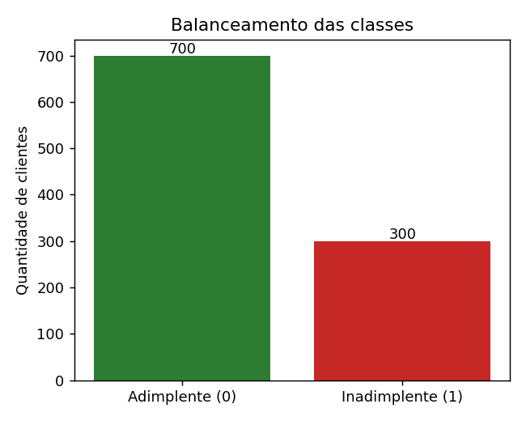
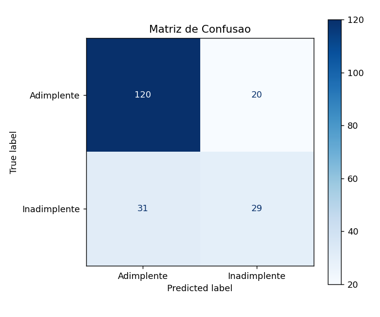
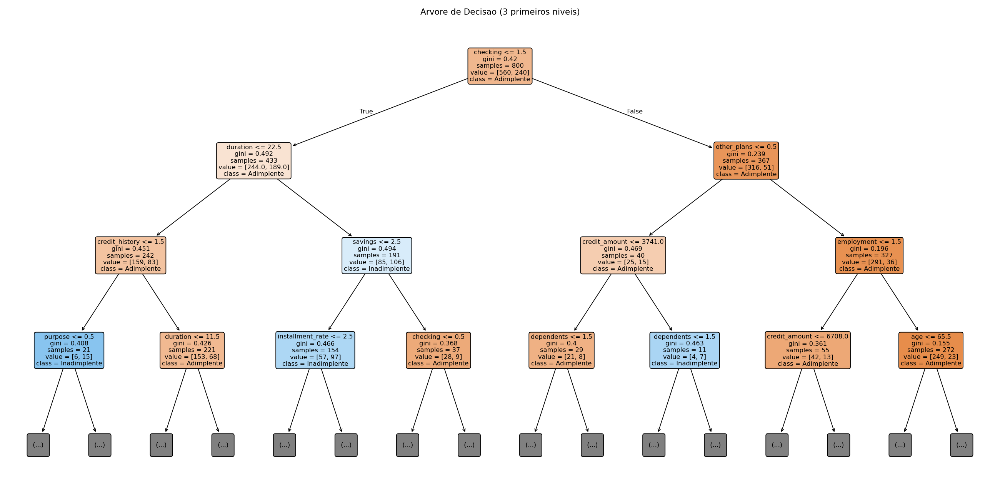
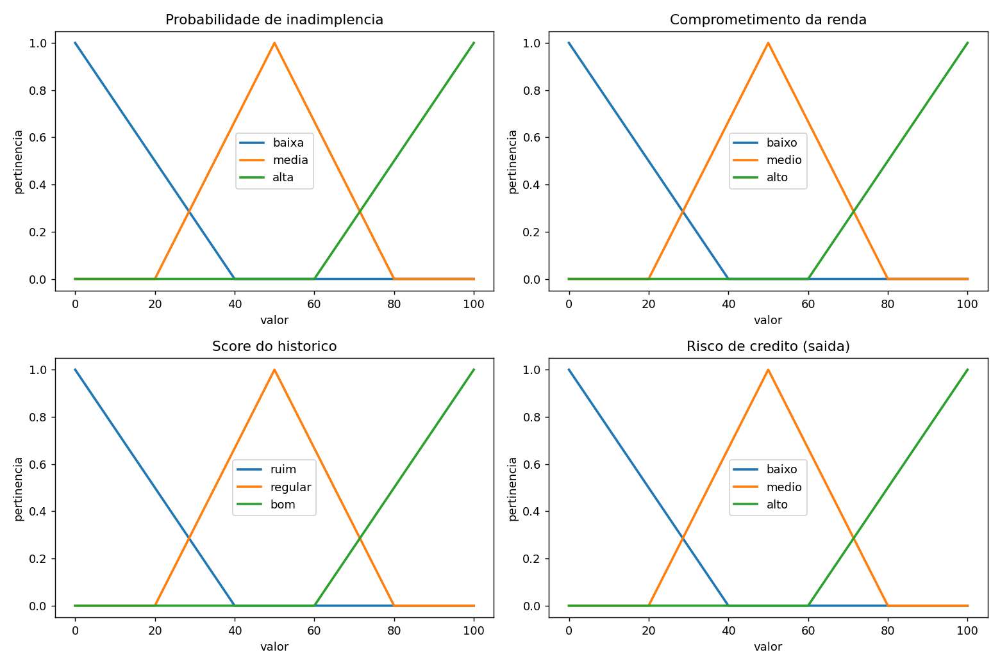
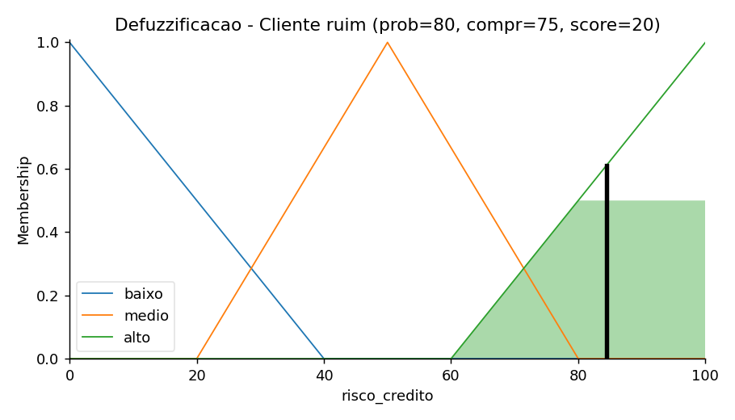
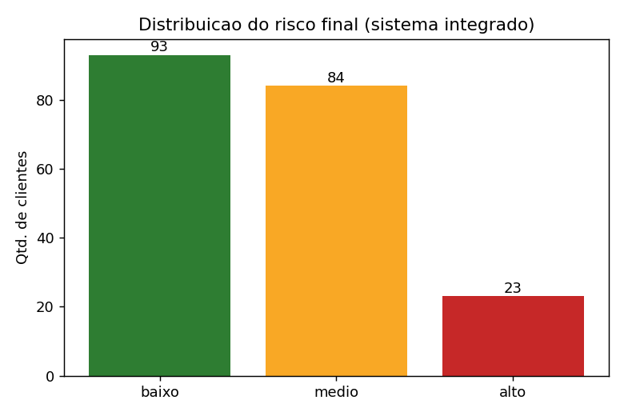

# Sistema Inteligente de Análise de Risco de Crédito
## Integração de Machine Learning e Lógica Fuzzy

**Trabalho Final Prático — Inteligência Artificial**

---

### Capa

| | |
|---|---|
| **Instituição** | Universidade Católica de Brasília (UCB) |
| **Curso** | Engenharia de Software |
| **Disciplina** | Inteligência Artificial |
| **Professor** | William Malvezzi |
| **Título** | Sistema Inteligente de Análise de Risco de Crédito: Integração de Machine Learning e Lógica Fuzzy |
| **Grupo** | Grupo 4 |
| **Integrantes** | _Edson Marcelino Luiz neto_ · _Leonardo Rodrigues Amorim Filho_ · _Cayky Emilio Vieira Neves_ · _Júlia Caroline Fernandes Borges_· _Arthur de Oliveira Freire_ |
| **Data de entrega** | _16/06/2026_ |

---

## Resumo

Este trabalho apresenta o desenvolvimento de um sistema inteligente de apoio à decisão para **análise de risco de concessão de crédito**, construído pela **integração** de duas abordagens centrais da disciplina de Inteligência Artificial: **Aprendizado de Máquina supervisionado** (Machine Learning) e **Lógica Fuzzy**. Um modelo de Árvore de Decisão é treinado sobre a base pública *Statlog (German Credit Data)*, com 1.000 registros reais, para estimar a probabilidade de inadimplência de um solicitante. Essa probabilidade é então fornecida como entrada a um Sistema de Inferência Fuzzy que, combinando-a ao comprometimento da renda e ao histórico de crédito por meio de regras linguísticas do tipo SE–ENTÃO, produz um **risco final interpretável** (baixo, médio ou alto). O modelo de classificação alcançou **acurácia de 74,5%** no conjunto de teste, e a camada fuzzy reclassificou **28% dos clientes** em relação ao uso isolado do modelo, demonstrando seu valor como camada de regras de negócio. O documento detalha a fundamentação teórica, a base de dados, o pré-processamento, a arquitetura da solução, os resultados experimentais e uma discussão crítica das limitações e melhorias.

**Palavras-chave:** Inteligência Artificial; Lógica Fuzzy; Machine Learning; Árvore de Decisão; Risco de Crédito; Sistemas de Inferência Fuzzy.

---

## 1. Introdução

### 1.1 Contexto e problema

A concessão de crédito é uma das decisões mais críticas no setor financeiro. Conceder crédito a um cliente que não honrará a dívida (inadimplente) gera perdas diretas; recusar crédito a um bom pagador representa perda de oportunidade. A decisão é, por natureza, **incerta** e baseada em múltiplos fatores parcialmente subjetivos — renda, histórico de pagamento, comprometimento da renda, score — que raramente possuem fronteiras nítidas (a partir de qual renda um cliente é "de renda alta"?).

Esse cenário é especialmente adequado à combinação de duas técnicas de Inteligência Artificial:
- O **Machine Learning** identifica, a partir de dados históricos, padrões estatísticos associados à inadimplência que seriam difíceis de codificar manualmente.
- A **Lógica Fuzzy** representa a imprecisão dos conceitos do domínio ("comprometimento alto", "histórico ruim") por meio de variáveis linguísticas, permitindo decisões graduais e **explicáveis** por regras próximas ao raciocínio de um analista humano.

### 1.2 Justificativa da aplicação de IA

A aplicação de IA justifica-se porque o problema envolve (i) **aprendizado de padrões** a partir de um volume de dados não tratável manualmente e (ii) **representação de incerteza e linguagem** imprecisa. Modelos puramente baseados em regras fixas (limiares rígidos) ignoram a transição suave entre categorias; modelos puramente estatísticos produzem uma probabilidade pouco interpretável para o tomador de decisão. A integração das duas abordagens visa uma solução simultaneamente **acurada** (orientada a dados) e **interpretável** (orientada a regras).

### 1.3 Objetivo geral

Desenvolver uma solução prática de Inteligência Artificial capaz de analisar dados de solicitantes de crédito e apoiar a decisão de concessão, por meio da combinação entre Machine Learning e Lógica Fuzzy.

### 1.4 Objetivos específicos

1. Selecionar um problema adequado à aplicação de IA — análise de risco de crédito (Tema 4).
2. Utilizar uma base de dados pública e coerente com o problema.
3. Realizar pré-processamento e análise exploratória dos dados.
4. Implementar um modelo de Machine Learning para classificação.
5. Avaliar o modelo com métricas adequadas ao tipo de problema.
6. Construir um sistema fuzzy com variáveis linguísticas, funções de pertinência e regras de inferência.
7. Integrar os resultados do modelo de Machine Learning ao sistema fuzzy.
8. Apresentar uma análise crítica dos resultados, limitações e melhorias.

---

## 2. Fundamentação Teórica

### 2.1 Inteligência Artificial e Aprendizado de Máquina

**Inteligência Artificial (IA)** é o campo que estuda a construção de agentes capazes de perceber o ambiente e agir de modo a maximizar suas chances de atingir objetivos (RUSSELL; NORVIG, 2013). O **Aprendizado de Máquina (Machine Learning)** é o subcampo no qual os sistemas aprendem padrões a partir de dados, em vez de serem explicitamente programados para cada caso.

No **aprendizado supervisionado**, o modelo é treinado com exemplos rotulados (entrada → saída conhecida). Distinguem-se dois tipos de problema:
- **Classificação:** a saída é uma categoria (ex.: bom pagador / mau pagador).
- **Regressão:** a saída é um valor numérico contínuo.

Este trabalho trata de um problema de **classificação binária** (adimplente / inadimplente).

### 2.2 Árvore de Decisão

A **Árvore de Decisão** é um algoritmo de aprendizado supervisionado que constrói uma estrutura hierárquica de testes condicionais sobre os atributos. Cada nó interno representa uma pergunta sobre uma variável (ex.: "a duração do crédito é maior que 24 meses?"), cada ramo uma resposta, e cada folha uma decisão (classe prevista). A árvore é construída de forma a maximizar a separação entre as classes a cada divisão, tipicamente por critérios como o índice de Gini ou a entropia.

Foi escolhida por dois motivos alinhados ao enunciado: é a **preferência da disciplina** e oferece **alta interpretabilidade** — é possível visualizar e justificar cada decisão, o que dialoga diretamente com as regras explícitas do sistema fuzzy.

### 2.3 Lógica Fuzzy e Conjuntos Nebulosos

A **Lógica Fuzzy**, formalizada por Zadeh (1965), generaliza a lógica clássica binária ao admitir **valores de verdade parciais**. Enquanto na teoria clássica um elemento pertence ou não pertence a um conjunto (pertinência 0 ou 1), na **teoria dos conjuntos nebulosos (fuzzy)** um elemento pertence a um conjunto com um **grau de pertinência** no intervalo [0, 1].

Essa propriedade permite representar conceitos imprecisos do mundo real. Um comprometimento de renda de 50% pode pertencer simultaneamente, com graus distintos, aos conjuntos "médio" e "alto".

### 2.4 Componentes de um Sistema de Inferência Fuzzy

- **Variável linguística:** variável cujos valores são termos da linguagem (ex.: a variável *comprometimento* assume os termos *baixo*, *médio*, *alto*). Formalmente descrita pela quíntupla `<x, T(x), U, G, M>`.
- **Função de pertinência μ(x):** função que quantifica o grau de pertinência de cada elemento do universo a um conjunto fuzzy. Neste trabalho utilizam-se funções **triangulares** (`trimf`), definidas por três pontos.
- **Regras de inferência (SE–ENTÃO):** codificam o conhecimento especialista. Ex.: *SE prob. de inadimplência é alta E comprometimento é alto ENTÃO risco é alto*. Os operadores são E = mínimo, OU = máximo, NÃO = complemento (1 − μ).
- **Fuzzificação:** conversão dos valores numéricos de entrada em graus de pertinência.
- **Inferência:** aplicação da base de regras sobre os valores fuzzificados, agregando as conclusões.
- **Defuzzificação:** conversão do conjunto fuzzy resultante de volta para um número único. Adota-se o método do **centroide (centro de gravidade)**.

---

## 3. Descrição da Base de Dados

### 3.1 Origem e características

Utilizou-se a base **Statlog (German Credit Data)**, disponibilizada pelo *UCI Machine Learning Repository* (HOFMANN). Por se tratar de base pública, conforme o enunciado, apenas o link de acesso é informado, dispensando o envio do arquivo.

| Característica | Valor |
|---|---|
| Registros | 1.000 solicitantes de crédito |
| Atributos | 20 (+ variável-alvo) |
| Variável-alvo original | 1 = bom pagador; 2 = mau pagador |
| Origem | Alemanha (dados reais) |
| Valores faltantes | Nenhum |

### 3.2 Variável-alvo

A variável-alvo foi recodificada para uso binário em classificação:

```python
df['inadimplente'] = (df['class'] == 2).astype(int)   # 1 = inadimplente, 0 = adimplente
```

### 3.3 Atributos utilizados

Os 20 atributos incluem situação da conta corrente, duração do crédito, **histórico de crédito**, finalidade, valor solicitado, poupança, tempo de emprego, **taxa de comprometimento da renda (installment rate)**, estado civil/sexo, fiadores, tempo de residência, propriedades, idade, outros planos de crédito, moradia, créditos existentes, tipo de emprego, número de dependentes, telefone e situação de estrangeiro.

Três atributos têm papel central na camada fuzzy (Seção 6):

| Atributo da base | Uso no sistema |
|---|---|
| `credit_history` (códigos A30–A34) | derivação do `score_historico` |
| `installment_rate` (1–4) | derivação do `comprometimento` |
| probabilidade prevista pelo modelo | `prob_inadimplencia` |

### 3.4 Limitações da base

A base data da década de 1990 e refere-se ao mercado alemão; seus padrões podem não refletir o contexto atual. Além disso, é **desbalanceada** (700 adimplentes / 300 inadimplentes), o que exige atenção na avaliação (Seção 7).

---

## 4. Pré-processamento dos Dados

### 4.1 Análise exploratória (EDA)

A análise exploratória confirmou a ausência de valores faltantes e quantificou o desbalanceamento das classes (70% adimplentes / 30% inadimplentes). Foram inspecionadas as distribuições de variáveis numéricas (idade, valor do crédito e duração) por histogramas.



**Figura 1 —** Distribuição das classes na base: 700 adimplentes e 300 inadimplentes, evidenciando o desbalanceamento.

### 4.2 Determinação empírica da direção do `installment_rate`

A documentação do UCI não especifica se um `installment_rate` maior corresponde a maior ou menor comprometimento da renda. Em vez de assumir arbitrariamente, a direção foi determinada **empiricamente** pela correlação do atributo com a inadimplência:

```python
correlacao = df['installment_rate'].corr(df['inadimplente'])   # resultado: 0,072 (positiva)
```

| `installment_rate` | Inadimplência média |
|---|---|
| 1 | 0,250 |
| 2 | 0,268 |
| 3 | 0,287 |
| 4 | 0,334 |

A correlação positiva (0,072) confirma que **valores maiores indicam maior comprometimento**, validando a normalização direta para a escala 0–100:

```python
df['comprometimento'] = (df['installment_rate'] - 1) / 3 * 100   # 1→0, 4→100
```

### 4.3 Construção das variáveis linguísticas derivadas

O `score_historico` (0–100) foi derivado do `credit_history` por uma **regra de negócio**, na qual históricos de pagamento melhores recebem notas maiores:

| Código | Significado | Score |
|---|---|---|
| A34 | conta crítica / outros créditos | 10 |
| A33 | atraso de pagamento no passado | 30 |
| A30 | nenhum crédito / todos quitados | 50 |
| A32 | créditos existentes pagos em dia | 70 |
| A31 | todos os créditos no banco pagos em dia | 90 |

### 4.4 Codificação e particionamento

As variáveis categóricas (codificadas como `A11`, `A34` etc.) foram convertidas para valores numéricos com `LabelEncoder`, requisito para o treinamento da árvore. A base foi particionada em **treino (80% = 800 registros)** e **teste (20% = 200 registros)**, com `random_state=42` para reprodutibilidade e estratificação pela variável-alvo:

```python
idx_treino, idx_teste = train_test_split(
    df.index, test_size=0.2, random_state=SEMENTE, stratify=y)
```

O particionamento por índice permite recuperar, na fase de integração, as variáveis fuzzy (`comprometimento`, `score_historico`) alinhadas a cada cliente do conjunto de teste.

---

## 5. Modelo de Machine Learning

### 5.1 Algoritmo e configuração

Foi utilizado o `DecisionTreeClassifier` da biblioteca *scikit-learn*, com profundidade máxima limitada a 5 níveis (`max_depth=5`) para mitigar o sobreajuste (*overfitting*) e favorecer a generalização:

```python
arvore = DecisionTreeClassifier(max_depth=5, random_state=SEMENTE)
arvore.fit(X_treino, y_treino)
```

### 5.2 Métricas de avaliação e seu significado

| Métrica | Definição |
|---|---|
| **Acurácia** | proporção total de previsões corretas |
| **Matriz de confusão** | distribuição de acertos e erros por classe |
| **Precisão** | dos classificados como inadimplentes, quantos de fato eram |
| **Recall** | dos inadimplentes reais, quantos foram identificados |
| **F1-score** | média harmônica entre precisão e recall |

No domínio de crédito, o **recall da classe inadimplente** é particularmente relevante, pois deixar de identificar um mau pagador (falso negativo) costuma ter custo superior ao de recusar um bom pagador (falso positivo).

### 5.3 Resultados do modelo

O modelo obteve **acurácia de 74,5%** no conjunto de teste. O relatório de classificação completo:

| Classe | Precisão | Recall | F1-score | Suporte |
|---|---|---|---|---|
| Adimplente (0) | 0,79 | 0,86 | 0,82 | 140 |
| Inadimplente (1) | 0,59 | 0,48 | 0,53 | 60 |
| **Acurácia** | | | **0,74** | 200 |
| Média macro | 0,69 | 0,67 | 0,68 | 200 |
| Média ponderada | 0,73 | 0,74 | 0,74 | 200 |

**Matriz de confusão (conjunto de teste, 200 clientes):**

| | Previsto: Adimplente | Previsto: Inadimplente |
|---|---|---|
| **Real: Adimplente** | 120 (VN) | 20 (FP) |
| **Real: Inadimplente** | 31 (FN) | 29 (VP) |



**Figura 2 —** Matriz de confusão no conjunto de teste (200 clientes).



**Figura 3 —** Três primeiros níveis da Árvore de Decisão treinada, evidenciando as decisões interpretáveis do modelo.

### 5.4 Interpretação

O modelo apresenta bom desempenho na identificação de adimplentes (recall 0,86), mas recall de apenas **0,48** para inadimplentes — identifica menos da metade dos maus pagadores (29 de 60). Esse comportamento é consequência direta do **desbalanceamento da base** (a classe adimplente domina o aprendizado) e constitui a principal limitação do modelo, discutida na Seção 8.

### 5.5 A ponte entre os modelos

O método `predict_proba` fornece a probabilidade de inadimplência de cada cliente, em vez de apenas o rótulo. Esse valor (0–100%) é a saída do ML que alimenta o sistema fuzzy:

```python
prob_inadimplencia_teste = arvore.predict_proba(X_teste)[:, 1] * 100
```

---

## 6. Sistema de Inferência Fuzzy

Implementado com a biblioteca *scikit-fuzzy* (`skfuzzy.control`).

### 6.1 Variáveis e universos de discurso

| Variável | Tipo | Universo | Termos linguísticos |
|---|---|---|---|
| `prob_inadimplencia` | entrada (antecedente) | 0–100 | baixa, media, alta |
| `comprometimento` | entrada (antecedente) | 0–100 | baixo, medio, alto |
| `score_historico` | entrada (antecedente) | 0–100 | ruim, regular, bom |
| `risco_credito` | saída (consequente) | 0–100 | baixo, medio, alto |

### 6.2 Funções de pertinência

Foram adotadas funções **triangulares** (`trimf`), conforme preferência do enunciado. Exemplo para a probabilidade de inadimplência:

```python
prob['baixa'] = fuzz.trimf(prob.universe, [0, 0, 40])
prob['media'] = fuzz.trimf(prob.universe, [20, 50, 80])
prob['alta']  = fuzz.trimf(prob.universe, [60, 100, 100])
```

As três funções de cada variável cobrem integralmente o universo 0–100 e se sobrepõem, permitindo pertinência parcial simultânea.



**Figura 4 —** Funções de pertinência triangulares das três variáveis de entrada e da variável de saída.

A defuzzificação foi definida explicitamente como **centroide**:

```python
risco.defuzzify_method = 'centroid'
```

### 6.3 Base de regras

Foram definidas **9 regras próprias**, organizadas em dois grupos. As três primeiras (regras-base) ancoram a decisão na probabilidade do modelo de ML e garantem que, para qualquer entrada, ao menos uma regra seja ativada (cobertura completa). As seis seguintes (refinamento) ajustam o risco conforme o comprometimento e o histórico, à semelhança do julgamento de um analista de crédito.

```python
# Regras-base (cobertura, ancoradas no ML)
r1 = ctrl.Rule(prob['alta'],  risco['alto'])
r2 = ctrl.Rule(prob['media'], risco['medio'])
r3 = ctrl.Rule(prob['baixa'], risco['baixo'])
# Regras de refinamento
r4 = ctrl.Rule(prob['alta']  & comp['alto'],  risco['alto'])
r5 = ctrl.Rule(prob['alta']  & hist['ruim'],  risco['alto'])
r6 = ctrl.Rule(prob['baixa'] & hist['bom'],   risco['baixo'])
r7 = ctrl.Rule(prob['baixa'] & comp['baixo'], risco['baixo'])
r8 = ctrl.Rule(prob['media'] & hist['regular'], risco['medio'])
r9 = ctrl.Rule(prob['media'] & comp['medio'] & hist['regular'], risco['medio'])
```

O enunciado exige no mínimo 6 regras; foram utilizadas 9 para tornar o sistema robusto e realista.

### 6.4 Processo de inferência

Para cada cliente, o simulador executa as três etapas — **fuzzificação → inferência → defuzzificação** — produzindo um valor numérico de risco (0–100), posteriormente rotulado: ≤ 33 baixo, ≤ 66 médio, > 66 alto. Uma rede de segurança (`try/except`) contabiliza eventuais entradas sem regra ativa; na execução, esse contador permaneceu em **zero**, confirmando a cobertura completa da base de regras.

---

## 7. Integração ML → Fuzzy

### 7.1 Estratégia (Abordagem B — Integração)

Adotou-se a **Integração**: a saída do modelo de Machine Learning (probabilidade de inadimplência) é utilizada como **entrada** do sistema fuzzy, que a combina ao comprometimento e ao histórico para gerar o risco final. O fluxo completo:

```
Dados do cliente → [Árvore de Decisão] → prob. inadimplência (0–100%)
                 → [Sistema Fuzzy: prob + comprometimento + histórico]
                 → Risco final (baixo / médio / alto)
```

```python
def classificar_risco(p, c, s):
    simulador.input['prob_inadimplencia'] = p
    simulador.input['comprometimento']   = c
    simulador.input['score_historico']   = s
    simulador.compute()                       # fuzzificação + inferência + defuzzificação
    return simulador.output['risco_credito']
```

### 7.2 Aplicação ao conjunto de teste

O sistema integrado foi aplicado aos 200 clientes do conjunto de teste. Verificou-se que a faixa de risco atribuída é coerente com a inadimplência real observada (a faixa "alto" concentra maior taxa de inadimplência que a faixa "baixo").

---

## 8. Resultados e Discussão

### 8.1 Coerência do sistema (cenários de teste)

Quatro perfis representativos foram submetidos ao sistema fuzzy:

| Perfil | Prob. (%) | Comprom. (%) | Score | Risco (valor) | Classificação |
|---|---|---|---|---|---|
| Cliente ótimo | 10 | 20 | 90 | 14,0 | **BAIXO** |
| Cliente mediano | 45 | 50 | 50 | 50,0 | MÉDIO |
| Cliente ruim | 80 | 75 | 20 | 84,4 | **ALTO** |
| Cliente ambíguo | 55 | 30 | 70 | 50,0 | MÉDIO |

Os resultados são coerentes: perfis claramente bons recebem risco baixo e perfis claramente ruins recebem risco alto, com gradação suave para os casos intermediários.



**Figura 5 —** Defuzzificação pelo método do centroide para o perfil "cliente ruim", resultando em risco 84,4 (ALTO).

A distribuição do risco final atribuído aos 200 clientes do conjunto de teste — 93 de risco baixo, 84 médio e 23 alto — confirma que o sistema discrimina os perfis em vez de concentrar todos numa única faixa.



**Figura 6 —** Distribuição das classificações de risco produzidas pelo sistema integrado no conjunto de teste.

### 8.2 Valor agregado da integração

Para evidenciar que a camada fuzzy não apenas "reembrulha" a saída do modelo, comparou-se o risco final com a classificação que resultaria de usar **apenas a probabilidade do ML**. O sistema fuzzy **alterou a classificação de 56 dos 200 clientes (28%)**. Exemplos:

| Cliente | Prob. (%) | Comprom. (%) | Score | Só ML | Integrado |
|---|---|---|---|---|---|
| 30 | 31,3 | 66,7 | 70 | baixo | médio |
| 128 | 31,3 | 100,0 | 10 | baixo | médio |
| 346 | 66,7 | 100,0 | 10 | alto | médio |
| 537 | 31,3 | 66,7 | 10 | baixo | médio |

Nesses casos, o comprometimento elevado e/ou o histórico ruim **deslocaram o risco para cima** (clientes 30, 128, 537), enquanto, no cliente 346, a combinação de fatores moderou um risco que o ML isolado classificaria como alto. Isso demonstra concretamente o ganho de **interpretabilidade e ajuste por regras de negócio** proporcionado pela integração.

### 8.3 Limitações

- **Desbalanceamento da base:** com 70% de adimplentes, o modelo tende a favorecer essa classe, resultando em baixo recall (0,48) para inadimplentes — meta-problema relevante no domínio de crédito.
- **Antiguidade e contexto da base:** dados da década de 1990 do mercado alemão.
- **Subjetividade do projeto fuzzy:** funções de pertinência e limiares de faixa (33/66) foram definidos pela equipe; são, por natureza, subjetivos.
- **Codificação nominal:** o `LabelEncoder` impõe ordem numérica artificial a variáveis nominais (ex.: finalidade do crédito); para a Árvore de Decisão o impacto é reduzido, mas o ideal seria *one-hot encoding*.
- **Redundância intencional:** a probabilidade do ML já incorpora, implicitamente, comprometimento e histórico; reutilizá-los no fuzzy é uma decisão deliberada, voltada à interpretabilidade, e não uma duplicação acidental.

### 8.4 Melhorias futuras

- Aplicar técnicas de balanceamento (ex.: SMOTE) ou ajuste de `class_weight` para elevar o recall de inadimplentes.
- Comparar a Árvore de Decisão com outros algoritmos (Random Forest, Naive Bayes).
- Refinar a base de regras fuzzy com apoio de especialista do domínio e expandir o conjunto de regras.
- Substituir o `LabelEncoder` por *one-hot encoding* nas variáveis nominais.

---

## 9. Conclusão

O trabalho desenvolveu, de ponta a ponta, uma solução de Inteligência Artificial que **integra Machine Learning e Lógica Fuzzy** para a análise de risco de crédito. A Árvore de Decisão forneceu uma estimativa de probabilidade de inadimplência aprendida de dados reais (acurácia de 74,5%), e o Sistema de Inferência Fuzzy converteu essa estimativa, por meio de regras SE–ENTÃO próprias, em um risco final interpretável.

Foram exercitados todos os conceitos centrais da disciplina — fuzzificação, variáveis linguísticas, funções de pertinência, inferência e defuzzificação — articulados a um modelo supervisionado de classificação e suas métricas de avaliação. A análise demonstrou que a integração agrega valor concreto: em 28% dos casos, a camada fuzzy ajustou a decisão do modelo com base em regras de negócio, aumentando a transparência sem descartar o poder preditivo do aprendizado de máquina.

A principal limitação identificada — o baixo recall para inadimplentes, decorrente do desbalanceamento da base — aponta o caminho natural para trabalhos futuros, centrados no balanceamento de classes e na comparação de algoritmos.

---

## 10. Referências

HOFMANN, Hans. **Statlog (German Credit Data)**. UCI Machine Learning Repository. Disponível em: https://archive.ics.uci.edu/dataset/144/statlog+german+credit+data. Acesso em: jun. 2026.

RUSSELL, Stuart; NORVIG, Peter. **Inteligência Artificial**. 3. ed. Rio de Janeiro: Elsevier, 2013.

SCIKIT-FUZZY. **Documentation**. Disponível em: https://pythonhosted.org/scikit-fuzzy/. Acesso em: jun. 2026.

SCIKIT-LEARN. **User Guide**. Disponível em: https://scikit-learn.org/stable/user_guide.html. Acesso em: jun. 2026.

ZADEH, Lotfi A. **Fuzzy Sets**. Information and Control, v. 8, n. 3, p. 338–353, 1965.

MALVEZZI, William. **Slides da disciplina de Inteligência Artificial: Lógica Fuzzy e Machine Learning**. Material interno, UCB, 2025.

---

## 11. Anexos

- **Anexo A — Código-fonte completo:** notebook `trabalho_credito_fuzzy_ml.ipynb` (Google Colab), comentado.
- **Anexo B — Instruções de execução:** arquivo `README.md`.
- **Anexo C — Base de dados:** *Statlog (German Credit Data)*, acessada via link do UCI (Seção 3).
- **Anexo D — Saídas de execução:** as figuras geradas pelo notebook (balanceamento, matriz de confusão, Árvore de Decisão, funções de pertinência, defuzzificação e distribuição do risco) foram inseridas ao longo das Seções 4 a 8, junto aos resultados que ilustram.
